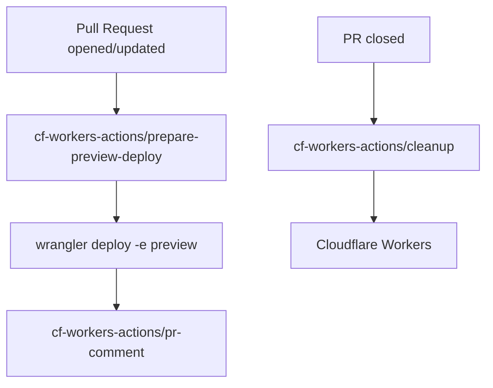
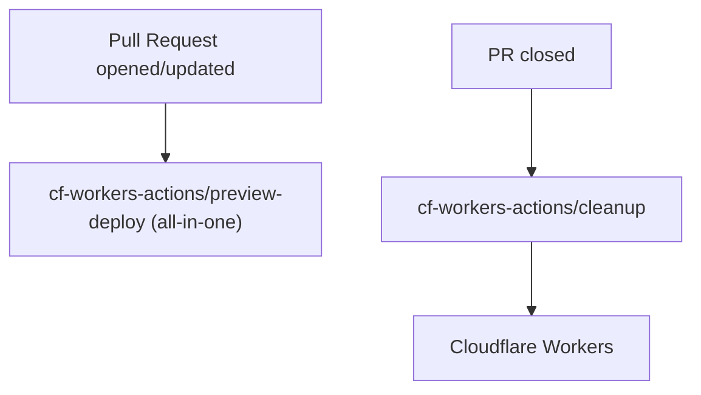

# cf-workers-actions

[](https://github.com/harunonsystem/cf-workers-actions/actions)
[](https://opensource.org/licenses/MIT)

Modular GitHub Actions for Cloudflare Workers preview deployments, PR comments, and cleanup.

Use this suite to ship preview environments to Cloudflare Workers, keep PR comments fresh, and clean up safely.

## What this suite solves
- Generate consistent preview URLs and worker names per PR/branch
- Deploy previews with one step or modular steps
- Keep PR comments up to date with deployment results
- Clean up old preview workers safely

## Actions (quick reference)
These four actions are provided by this repository:
- **prepare-preview-deploy** — Generate worker name/URL and update `wrangler.toml` for a preview env. Docs: [prepare-preview-deploy/](prepare-preview-deploy/)
- **preview-deploy** — All-in-one prepare + deploy + PR comment. Docs: [preview-deploy/](preview-deploy/)
- **pr-comment** — Post or update a PR comment with deployment info. Docs: [pr-comment/](pr-comment/)
- **cleanup** — Delete preview workers by pattern or explicit names. Docs: [cleanup/](cleanup/)

External action used in examples:
- **cloudflare/wrangler-action** — Official Cloudflare action for deploying with Wrangler.

Boolean inputs: GitHub Actions passes inputs as strings. Use `'true'` / `'false'`.

## Flow at a glance
### Modular preview (prepare → wrangler-action → pr-comment)


### All-in-one preview + cleanup


## Minimal usage
### All-in-one
```yaml
- uses: harunonsystem/cf-workers-actions/preview-deploy@v1
  with:
    cloudflare-api-token: ${{ secrets.CLOUDFLARE_API_TOKEN }}
    cloudflare-account-id: ${{ secrets.CLOUDFLARE_ACCOUNT_ID }}
    worker-name: 'myapp-pr-${{ github.event.pull_request.number }}'
    domain: 'example.workers.dev'
```

### Modular (prepare + wrangler + comment)
```yaml
- name: Prepare preview
  id: prepare
  uses: harunonsystem/cf-workers-actions/prepare-preview-deploy@v1
  with:
    worker-name: 'myapp-pr-${{ github.event.pull_request.number }}'
    environment: 'preview'
    domain: 'example.workers.dev'

- name: Deploy with Wrangler
  id: deploy
  uses: cloudflare/wrangler-action@v3
  with:
    apiToken: ${{ secrets.CLOUDFLARE_API_TOKEN }}
    accountId: ${{ secrets.CLOUDFLARE_ACCOUNT_ID }}
    command: deploy -e preview

- name: Comment on PR
  if: always()
  uses: harunonsystem/cf-workers-actions/pr-comment@v1
  with:
    deployment-url: ${{ steps.prepare.outputs.deployment-url }}
    deployment-name: ${{ steps.prepare.outputs.deployment-name }}
    deployment-success: ${{ steps.deploy.outcome == 'success' && 'true' || 'false' }}
```

### Cleanup previews on PR close
```yaml
- uses: harunonsystem/cf-workers-actions/cleanup@v1
  with:
    worker-pattern: 'myapp-pr-${{ github.event.pull_request.number }}'
    cloudflare-api-token: ${{ secrets.CLOUDFLARE_API_TOKEN }}
    cloudflare-account-id: ${{ secrets.CLOUDFLARE_ACCOUNT_ID }}
    dry-run: 'true'
```

## Secrets & permissions (quick)
- Cloudflare API token: use the "Workers:Edit" template; add `Zone:Read` only if deploying to custom domains.
- GitHub token: prefer the workflow-provided `GITHUB_TOKEN`; limit permissions (e.g., `contents: read`, `pull-requests: write` when commenting).
- For forked PRs, require approval before secrets run; keep `permissions:` minimal per job.

## Troubleshooting (fast)
- wrangler.toml edits are text replacements—validate in CI if your file is complex.
- Boolean-like inputs must be strings (`'true'` / `'false'`).
- If dist/ is stale, run `pnpm run build` and commit updated `dist/` (CI checks this).

## Docs & references
- Examples overview: [examples/README.md](examples/README.md)
- Modular (Wrangler action) example: [examples/preview-deploy/using-wrangler-action/README.md](examples/preview-deploy/using-wrangler-action/README.md)
- All-in-one example: [examples/preview-deploy/using-preview-deploy/README.md](examples/preview-deploy/using-preview-deploy/README.md)
- Cleanup examples: [examples/cleanup/README.md](examples/cleanup/README.md)
- Inputs/outputs (source of truth):
  - [prepare-preview-deploy schema](src/prepare-preview-deploy/schemas.ts)
  - [preview-deploy schema](src/preview-deploy/schemas.ts)
  - [pr-comment schema](src/pr-comment/schemas.ts)
  - [cleanup schema](src/cleanup/schemas.ts)
- Official Cloudflare Wrangler action docs: [cloudflare/wrangler-action](https://github.com/cloudflare/wrangler-action)

## License
MIT License. See [LICENSE](LICENSE).
